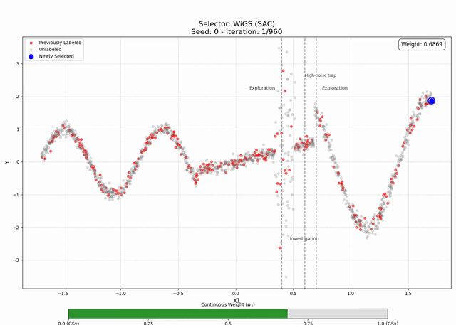

# Weighted improved Greedy Sampling (WiGS)

## Abstract

Active learning for regression aims to reduce labeling costs by intelligently selecting the most informative data points. A prominent active learning method, improved Greedy Sampling (iGS) by [Wu, Lin, and Huang (2018)](https://www.sciencedirect.com/science/article/abs/pii/S0020025518307680), determines which points are informative by balancing the feature space and the predicted output space using a static, multiplicative approach. We hypothesize that the optimal balance between these spaces is not fixed but is instead dynamic, depending on the dataset and the stage of the active learning procedure.

This paper introduces **Weighted improved Greedy Sampling (WiGS)**, a novel and flexible framework that recasts the selection criterion as a weighted, additive combination of normalized scores from the feature and predictive output space. We investigate several strategies for determining these weights: static balances, time-decay heuristics, and, most significantly, adaptive policies learned via reinforcement learning (Multi-Armed Bandits and Soft Actor-Critic). To ensure methodological rigor, our adaptive agents are trained on a "clean" reward signal based on K-fold cross-validation RMSE, while the final models are evaluated against the baseline using the standard `FullPool_RMSE` metric for a fair comparison. The SAC agent learns a data-driven policy to balance the exploration-exploitation trade-off at each iteration based on the current state of the learning process.

This entire framework is implemented as a robust, parallelized pipeline on a SLURM cluster. We evaluate our methods on 20 benchmark and synthetic regression datasets. The results demonstrate that the flexible WiGS approach, particularly the adaptive RL methods, can outperform the original iGS, demonstrating the value of adaptively balancing exploration and exploitation throughout the learning process.

## Preliminary Results

Preliminary quantitative results can be seen in the trace plots located in `Results/images/trace_plots/`. For each metric (e.g., RMSE), the `/trace` folder contains the absolute trace plots, while the `/trace_relative_iGS` folder contains the trace plots normalized relative to the iGS baseline.

These plots show that the adaptive **WiGS** methods, particularly those guided by reinforcement learning, generally outperform the static iGS baseline.

A visualization demonstrating the adaptive behavior of the `WiGS (SAC)` agent on the `dgp_three_regime` dataset is shown below. Observe how the agent adjusts its exploration (*w<sub>x</sub>* ≈ 1.0, red) / investigation (*w<sub>x</sub>* ≈ 0.0, blue) strategy in real-time based on the local characteristics of the data.

<div align="center">



</div>

## Setup

This project was developed using **Python 3.9**. A virtual environment is highly recommended.

1. **Create and Activate Environment:**
```bash
   # Using venv (recommended)
   python3 -m venv .WiGS_Env
   source ./.WiGS_Env/bin/activate
```

2. **Install Requirements:**
```bash
   pip install -r requirements.txt
```

## Automated Workflow on an HPC Cluster

The project is designed as an automated pipeline for a SLURM-based HPC cluster. The scripts in `Code/Cluster/` are numbered in their execution order.

**Note:** Before running, you may need to configure cluster-specific parameters (like partition names) in `Code/Cluster/CreateSimulationSbatch.py` and all `.sbatch` files.

1. `0_PreprocessData.sh`: Executes `utils/Auxiliary/PreprocessData.py` to download, generate, and clean all 20 datasets, saving them as `.pkl` files in `Data/processed/`.

2. `1_CreateSimulationSbatch.sh`: Runs `CreateSimulationSbatch.py` to create all necessary `Results/` sub-directories and generate the master `.sbatch` files (one for each dataset) in `Code/Cluster/RunSimulations/`.

3. `2_RunAllSimulations.sh`: Submits all the `master_job_*.sbatch` files to the SLURM scheduler. Each of these is a job array that runs one job for every *seed* (e.g., 100 replications). This is the main experiment and populates the `Results/simulation_results/raw/` directory.

4. `3_ProcessResults.sh`: **Run this after all simulations complete.** It executes `utils/Auxiliary/AggregateResults.py` to collect all raw `.pkl` files and save them into clean, aggregated `.csv` and `.pkl` files in `Results/simulation_results/aggregated/`.

5. `4_GenerateTracePlots.sbatch`: A parallel SLURM job array that runs *per dataset*. This single script efficiently generates three sets of results:
   - **All Trace Plots** (RMSE, MAE, R2, CC) for the dataset, saving to `Results/images/trace_plots/`.
   - **All Weight Trends** (average and individual) for the adaptive agents, saving to `Results/images/manuscript/average_weight_trends/` and `Results/images/appendices/individual_weight_trends/`.
   - **The Wilcoxon Test Table** (`.tex` file) for the dataset, saving to `Results/tables/`.

6. `5_GenerateManuscriptPlots.sh`: A local script that generates the "hero" figures for the manuscript. This is run once, after `3_ProcessResults.sh`. It creates:
   - The **Nearest Neighbor** conceptual visualization.
   - The **DGP plots** (two-regime and three-regime).
   - The **Weight Heatmaps** (average and individual) for the synthetic datasets.
   - The standalone **Legend** for the trace plots.

7. `6_GenerateSelectionVideos.sbatch`: A 2D SLURM job array that generates the `.mp4` video visualizations for each selector on the synthetic datasets. Saves to `Results/images/appendices/selection_videos/`.

8. `7_DeleteAuxiliaryFiles.sh` & `8_DeleteRawResults.sh`: Optional cleanup scripts to remove temporary SLURM logs and the large `raw/` simulation data.

## Directory Structure

- **`Code/`**: All executable code.
  - `Cluster/`: SLURM workflow scripts (`.sh`, `.sbatch`).
    - `RunSimulations/`: Holds generated `.sbatch` files and SLURM logs.
  - `utils/`: Core Python package.
    - `Auxiliary/`: Helper scripts (preprocessing, aggregation, plotting, visualization).
    - `Main/`: Main simulation engine (`LearningProcedure.py`).
    - `Prediction/`: ML model wrappers (`RidgeRegressionPredictor.py`) and error calculation (`FullPoolError.py`, `CrossValidation.py`).
    - `Selector/`: Active learning strategies (Random, GSx, iGS, WiGS variants).
- **`Data/`**:
  - `processed/`: Preprocessed `.pkl` datasets.
- **`Results/`**: All simulation outputs.
  - `images/`: All visual outputs.
    - `trace_plots/`: All trace plot results (RMSE, MAE, etc.) for all datasets.
    - `manuscript/`: The 5-6 core figures for the paper (DGPs, heatmaps, legend).
      - `average_weight_trends/`: Average *w<sub>x</sub>* trend plots for all datasets.
    - `appendices/`: Supporting figures for the appendix.
      - `individual_weight_heatmaps/`: Per-seed heatmaps for DGPs.
      - `individual_weight_trends/`: Per-seed *w<sub>x</sub>* trend plots.
      - `selection_videos/`: `.mp4` video visualizations.
  - `simulation_results/`: Numerical data.
    - `raw/`: Individual `.pkl` output from each cluster job (temporary).
    - `aggregated/`: Cleaned, aggregated data (permanent).
  - `tables/`: Final LaTeX tables for the Wilcoxon test results.

## Code Overview

### Main Simulation Engine (`Code/utils/Main/`)

- `LearningProcedure.py`: The core active learning loop. It trains a model, calculates both evaluation metrics, selects a point, and updates the datasets. Includes a final evaluation step after the loop to get the 100% labeled result.
- `RunSimulationFunction.py`: A wrapper that runs *all* selector strategies (Passive, iGS, WiGS-SAC, etc.) for a single seed, allowing for a head-to-head comparison.
- `OneIterationFunction.py`: Sets up the data (loading, initial train/candidate split) for a single strategy run and calls `LearningProcedure`.
- `TrainCandidateSplit.py`: A helper script that performs the initial `train_test_split`.

### Prediction & Evaluation (`Code/utils/Prediction/`)

- `RidgeRegressionPredictor.py`: A standardized wrapper for the `sklearn.linear_model.Ridge` model, providing `.fit()` and `.predict()` methods. (Includes `LinearRegressionPredictor` and `RandomForestRegressorPredictor` as well).
- `FullPoolError.py`: Calculates the evaluation metric (RMSE, R2, etc.) based on the iGS (2018) paper's "hybrid" method. This is used for the final plots.
- `CrossValidation.py`: Calculates the RL reward signal. It gets a data-efficient and stable K-fold `CV_RMSE` using only the labeled training set (*D<sub>tr</sub>*) to prevent data leakage.

### Selector Strategies (`Code/utils/Selector/`)

- `PassiveLearningSelector.py`: Randomly samples a point (baseline).
- `GreedySamplingSelector.py`: Implements the `GSx`, `GSy`, and `iGS` baselines from Wu et al. (2018).
- `WeightedGreedySamplingSelector.py`: Implements `WiGS` with static and time-decaying weight heuristics.
- `WiGS_MAB.py`: Implements `WiGS` with a Multi-Armed Bandit (UCB1) that learns the best average *w<sub>x</sub>* from the `CV_RMSE` reward.
- `WiGS_SAC.py`: Implements `WiGS` with a Soft Actor-Critic (SAC) agent that learns a *state-dependent policy* to choose the optimal *w<sub>x</sub>* at each step, based on the `CV_RMSE` reward and current state.
- `IDEALSelector.py` & `iRDMSelector.py`: Other published AL strategies used for comparison.

### Auxiliary & Plotting (`Code/utils/Auxiliary/`)

- `RunSimulation.py`: (In `Code/`) The main script called by SLURM. It parses the `TaskID` to determine the correct dataset and seed, then calls `RunSimulationFunction`.
- `AggregateResults.py`: Reads all raw `.pkl` files and combines them into aggregated `.csv` and `.pkl` files.
- `GeneratePlots.py`: Generates all trace plots for a given dataset. Also has a `--legend_only` mode to create the standalone legend.
- `PlotWeightHeatmap.py`: A dual-mode script that generates heatmaps.
  - `--seed 0` (or any int): Plots the heatmap for a single seed.
  - `--seed avg`: Plots the heatmap of the average *w<sub>x</sub>* across all seeds.
- `AnalyzeWeightTrends.py`: Generates plots showing the *w<sub>x</sub>* weight over time, supporting both average ("all") and single-seed plots.
- `WilcoxonRankSignedTest.py`: Runs a pairwise Wilcoxon signed-rank test on the aggregated results and saves a publication-ready `.tex` table.
- `GenerateDGPImage.py` & `NearestNeighborVisualization.py`: Scripts to generate specific, high-quality figures for the manuscript.
- `VisualizeSelections.py`: Generates all the `.png` frames and compiles them into a final `.mp4` video.